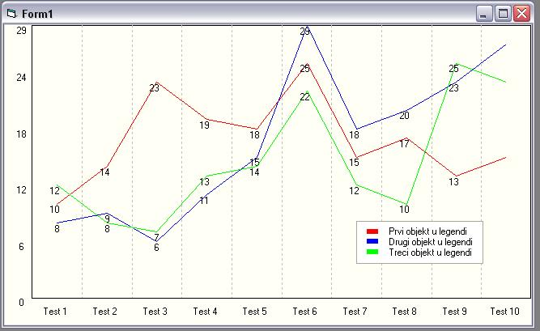



## Chart \(graph\)

### Description

Simple small activeX control to display graph, in VB or to make it save to file and use it in ASP. Movable legend, fast, uses only VB standard graphics functions. This was made to draw directly from recordset loop so it has everything in arrays. This is used in commercial program only in more advanced stage. Good example for beginners. Some votes would be nice
 
### More Info
 

             |
---                |---
**Submitted On**   |2004-09-16 23:03:36
**By**             |[Enver](https://github.com/Planet-Source-Code/PSCIndex/blob/master/ByAuthor/enver.md)
**Level**          |Advanced
**User Rating**    |4.7 (33 globes from 7 users)
**Compatibility**  |VB 5\.0, VB 6\.0, ASP \(Active Server Pages\) 
**Category**       |[Graphics](https://github.com/Planet-Source-Code/PSCIndex/blob/master/ByCategory/graphics__1-46.md)
**World**          |[Visual Basic](https://github.com/Planet-Source-Code/PSCIndex/blob/master/ByWorld/visual-basic.md)
**Archive File**   |[Chart\_\(gra1797209242004\.zip](https://github.com/Planet-Source-Code/enver-chart-graph__1-56335/archive/master.zip)

